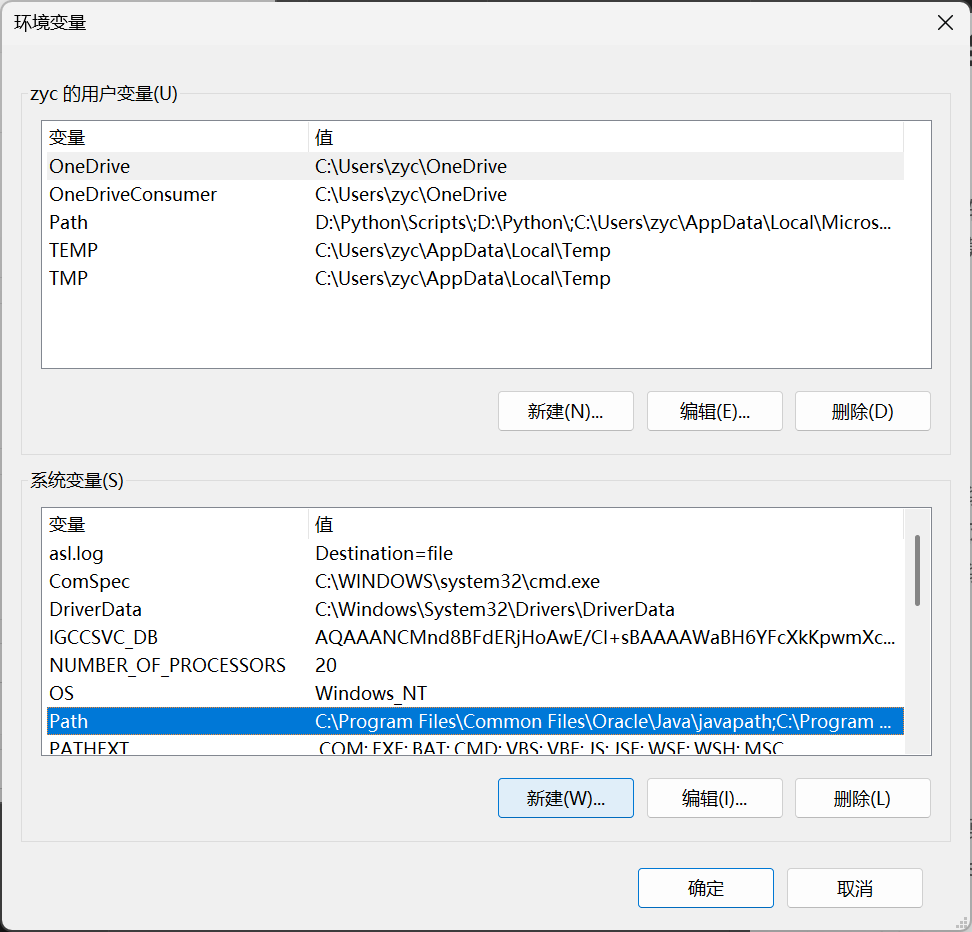

# 皇室战争的自动化对战脚本
拥有一定下牌逻辑，使用游戏中的“公式水人”卡组，在1v1休闲模式中自动对战的程序

## 快速使用
### 预先准备
请确保你已经安装了

装有皇室战争的网易mumu模拟器，分辨率为2560*1440

请确保你已经安装以下python库

uiautomator2

opencv2

numpy

### 安装
1. **配置ADB**
找到网易mumu模拟器shell的地址，一般为D:\Program Files\Netease\MuMuPlayer-12.0\shell

在设置中找到环境变量，在系统变量中的Path下新建地址，把刚才的地址复制进去，一路确定

2. **设置模拟器**
在模拟器的设置中找到开发者选项，打开其下的“USB调试”

3. **初始化uiautomator2**
在cmd中输入adb connect 127.0.0.1:16384

然后输入python -m uiautomator2 init

等待运行，如果在模拟器中看到名为“ATX”的图标为小车的应用，则初始化完成
### 运行程序
进入皇室战争，配置好卡组，切换到经典1v1模式

运行 main.py

## 注意事项
1. 最好根据自己的卡牌是否镀金，更新cards中的模板
2. capture.py 可以帮助你截取模拟器特定位置的截图
3. 皇室战争有时会连接中断，本项目没有解决这一问题
4. 本项目有可能因为过于快速被3冠而出现bug
5. 注意分辨率，如果不是2560*1440，checkType.py finalGetCards.py以及所有模板都要对应调整

## 文件作用
1. main.py 

主控程序，包括程序大循环的操作

游戏结束后到游戏下一次游戏开始时的操作在函数**operation_1**中

游戏中的操作（**下牌逻辑**）在函数**operation_2**中

2. checkType.py

检测游戏开始（检测圣水条的存在）

检测游戏结束（检测“确定”按键）

3. comCycle.py

包含**CRCardCycle**类，运算卡牌循环

**find_card** 寻找某一名称的卡在循环中的位置

**use_card** 模拟使用一张牌后的卡牌循环

**set_card** 直接设置某一位置为某一张卡

内含“卡牌被移出循环”功能，本来是为了应对英雄卡，现在已不必理会，已经被supercell优化掉了（

4. finalGetCards.py

含有**CRCardRecognizer**类

可以识别卡牌栏的五张牌，或识别这5个位置中某一位置的牌

5. getCycle.py

其中的**init5**函数是游戏开始时初始化获得开局的5张起手牌并写入CRCardCycle的程序

6. changeCycle.py

**过牌程序**

会按照函数**changeCycle**中的权重下牌，直到识别出所有牌且牌序符合函数**rigthCycle**中的要求

7. format2.py

包含单倍圣水、双倍圣水、三倍圣水时，公式水人的下牌顺序及位置

8. placeCard.py

包含预设的下牌位置和两个下牌函数

**placeCardN** 将某一名称的牌下在某位置（调用**CRCardCycle**中的**find_card**）

**placeCardP** 将某一位置的牌下在某位置

两个函数均会和**CRCardCycle**联动，且若使用后新进入的卡牌未知，会调用**CRCardRecognizer**

## 致谢

感谢deepseek帮我写了大部分程序

感谢大佬的[自动化教程](https://blog.csdn.net/sijia5135/article/details/105492779)

感谢来使用这个史山代码的大佬们，请大佬们谅解我写的太垃圾了（

